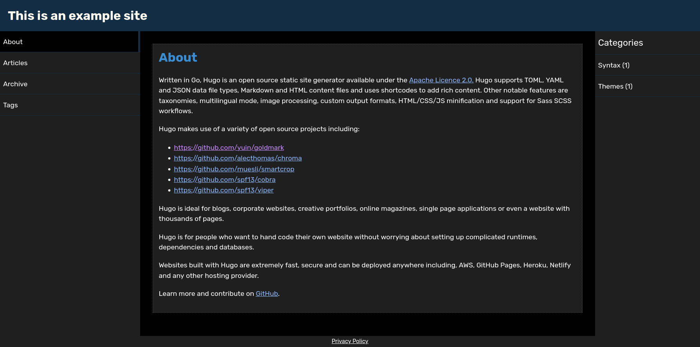
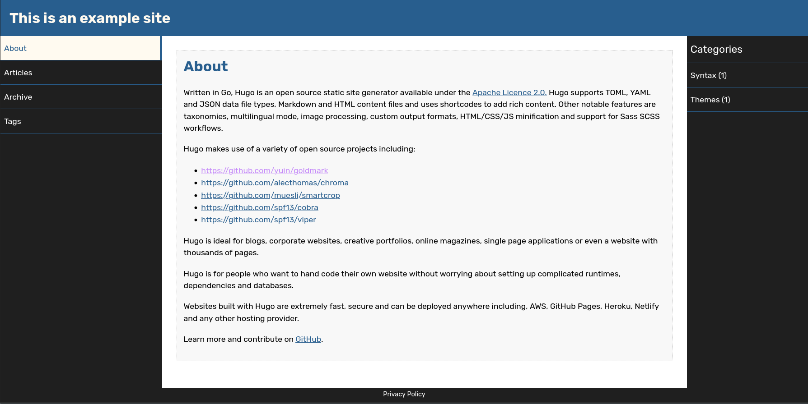
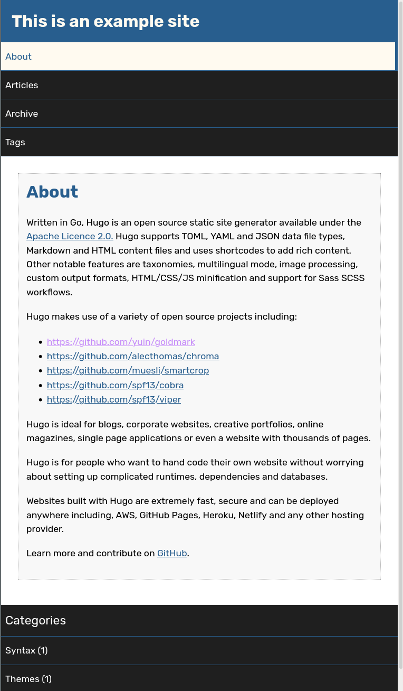

# Clean Hugo Blog Theme

## Screenshot

 - Darkmode

[](images/darkmode.png)

 - Lightmode
 
[](images/lightmode.png)

- Mobile

[](images/mobile.png)


## Features
 - Responsive
 - Dark / Light Mode Theme
   - Syntax highlighting for dark and light theme
 - Left and bottom navigation

## Installation 

 - Clone repository: 
   - `git clone https://github.com/lhooge/hugo-theme-hoogi.git`
 - To see the example site run command from exampleSite directory: 
   - `hugo server -t ../../  -D`
 - For theme installation see:
   - `gohugo.io/getting-started/quick-start/`
   
   
# Configuration

It is currently just 'useSummary' available for configuring. If set to 'true' a summary will be shown on list overview, 
otherwise the complete post is shown.

```
[Params]
useSummary = true | false
```

## License

Code License: Released under the [MIT](https://github.com/lhooge/hugo-theme-hoogi/blob/master/LICENSE) license.

## Third party 
 
 - Rubik font designed by Hubert and Fischer, Meir Sadan, Cyreal
   - https://fonts.google.com/specimen/Rubik